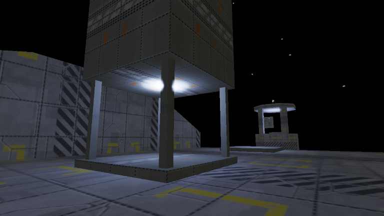

# Voiid

Author: Sebastien Alaiwan

Demo
----

An online demo is available here:

http://code.alaiwan.org/games/voiid

<p align="center"></p>

Description
-----------

This is a demo of a platform-independent C++14 game project.
It uses SDL2, and the OpenGL core profile.

It's meant as an example of a first-person exploration game
which can be compiled to native code, or, using Emscripten, to Javascript,
and maybe one day to WebAssembly.

The code doesn't contain any reference/dependency to Emscripten, except in the
entry-point file, where the main loop function gets passed to Emscripten.

This code also shows how to isolate your game logic code (doors, switches,
powerups, bullets, ..) from your I/O code (display, audio, input).

Directory structure
-------------------

```
src/gameplay:   source files for the game logic (agnostic to the engine implementation).
src/engine:     I/O code (=engine), mostly game-agnostic.
src/base:       interfaces for communication between the game logic and the I/O code. Also contains shared low-level utilities (e.g Vector2f, Span, etc.).
assets:         source files for game resources.
bin:            output directory for architecture-specific executable binaries.
res:            output directory for generated game resources (e.g. sounds, music, sprites, tilesets).
./check:        main check script. Call this to build native and asmjs versions and to launch the unit tests.
```


Build
-----

Requirements:
```
* libsdl2-dev
```

It can be compiled to native code using your native compiler (gcc or clang):

```
$ make
```

The binaries will be generated to a 'bin' directory
(This can be overriden using the BIN makefile variable).

It can also be compiled to Javascript, using Emscripten.
In theory, it's as simple as:

```
$ CXX=emcc make
```

However, in practice, more options need to be injected to the makefile,
like setting EXT (program extension) to ".html", etc.
See the function 'deliverWebVersion' in the file scripts/deliver.

Run the game
------------

Just run the following command:

```
$ bin/rel/game.exe
```

